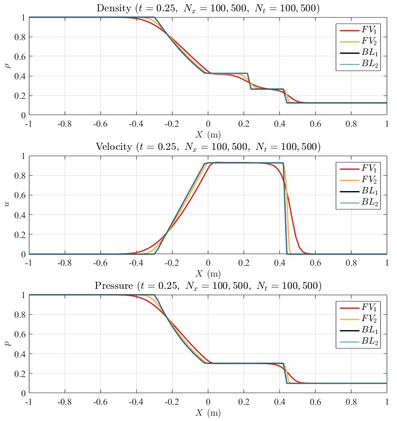

# AE 410: Final Project
Zitong Zhang (netID: zitongz2)
## 1 Write a finite volume solver for the Euler equations using Roe’s method of an approximate Riemann solver

The MATLAB function is `shock_tube_1d_solver.m`. Comments on its input and output variables are listed below.

```matlab
function [q1, q2, q3] = shcok_tube_1d_solver(...
    L1, L4, R, gamma, Nx, T_t, Nt, L_state, R_state, method, BC)
%%% -- input -- %%%
% L1      :: driven section length
% L4      :: driver section length
% R       :: gas constant
% gamma   :: specific heat ratio
% Nx      :: number of cells
% T_t     :: final physical time
% Nt      :: number of time-steps
% L_state :: driver section parameters, {p_L, T_L, u_L};
% R_state :: driven section parameters, {p_R, T_R, u_R};
% method  :: method of calculating numerical fluxes
%       Godunov's method - 'godunov' or 'theRussian'
%       Roe's method     - 'roe' or 'theBrit'
% BC      :: boundary condition type and wall velocity
%%% -- output -- %%%
% q1      :: matrix of conservd variable, density
% q2      :: matrix of conservd variable, momentum
% q3      :: matrix of conservd variable, energy
% rho_t   :: density at final time
% u_t     :: velocity at final time
% p_t     :: pressure at final time
```

## 2 Verify your code using the Toro Tests 1 and 2.

The boundary conditions are set to ”transmissive” for the 2 Toro Tests. The solution of density, velocity and pressure are plotted for each test case, where $BL_1$ is data provided on the course website, $BL_2$ is results from the Riemann solver developed in HW4. The finite volume solutions are denoted as $FV$ with a subscript indicating the different $N_x$ and $N_t$ used for the particular solution.

### (a) Toro Test 1



Toro Test 1 is a shock to the right and an expansion fan to the left with a contact discontinuity in between. As was shown in homework 4, the exact Riemman solver matches the posted solution very well.

Overall the finite volume solution captures the key features of the shock and expansion fan. But due to numerical dissipation, the shock and the heads and tails of the expansion fan is smoother than the exact solutions. The contact discontinuity is even more under-resolved and smeared out, as shown in the density plots. The dissipation is reduced as the number of cells increase from $N_{x,1} = 100$ to $N_{x,2} = 500$.

### (b) Toro Test 2

The original Toro Test 2 is a very strong rarefaction, which is known to be very difficult for the basic Roe’s method to handle. The code developed in this project failed to complete this test as expected, generating negative pressure and imaginary speed of sound in the solution.

A modified test case with a weaker rarefaction wave is used to verify the code, where $\rho_L = 1.0$, $u_L = −0.5$, $p_L = 0.4$; $\rho_R = 1.0$, $u_R = 0.5$, $p_R = 0.4$. The solutions are plotted below:


Similar to Toro Test 1, the dissipation is reduced as the number of cells increase from $N_{x,1} = 100$ to $N_{x,2} = 500$.

## 3 Using the Roe solver, simulate a shock tube problem.
### (a) Make a contour plot of the pressure, density, temperature and velocity in the $x–t$ plane.

Using $N_x = 2000$, $N_t = 20000$, the pressure, density, velocity and temperature are plotted below. To assist the visualization, the pressure, density and temperature solutions are plotted on a $log_{10}$ colormap scale. The pressure and density contour use a sequential colormap where darker color indicates higher value. The temperature contour uses the ”black-body radiation” colormap. Finally the velocity contour uses a ”cool-warm” colormap where red represents velocity to the right and blue represents velocity to the left. Again, a darker color indicates a larger magnitude.


#### (i) Primary shock and right boundary

The primary shock refects from the right boundary at $t = 0.0174 s$, which is clearly present in all four plots (square black marker).

#### (ii) Primary shock and contact discontinuity

The contact discontinuity is only present in the density and temperature contour. As is known from the Riemann Problem, the pressure and velocity across the contact discontinuity is constant. Although the contact discontinuity is slightly smoothed out by the Roe’s scheme, it is still identifiable in the density and temperature contour.

With the contact discontinuity and primary shock identified, where they interact becomes very clear (**round black marker**). In fact, when the primary shock and the contact discontinuity interact, a small region of high density, high pressure, high temperature and high velocity gradient are easily visible.

#### (iii) Expansion fan

To identify the expansion fan, the controur plots are zoomed in to focus on the left section of the shock tube. A region of high density, high pressure and high temperature can be seen very clearly in all three contour plots. The point at which the head of the expansion fan meets the left boundary is plotted as a square black marker.


### (b) Measure the primary shock Mach number using data from the $x − t$ diagram and compare it to the theoretical value.

First, calculate the theoretical value.
$$
\dfrac{p_4}{p_1} = \dfrac{100}{0.1} = 1000,	\qquad
c_4 = c_1 = \sqrt{\gamma R T} = \sqrt{1.4\times 287 \times 293} = 343.1143\ \mathrm{m/s}
$$

Using Matlab’s `fzero` function, the theoretical value for the primary shock Mach number can be calculated to be: $M_{s,th} = 3.1505$.

At a given time step, the primary shock is almost always characterized by a huge jump in the velocity data $u − x$. Using this information, the location of the primary shock at each time step can be determined.


Using a linear fit of the data before $t = 0.016s$, the primary shock’s velocity can be measured. Repeat the process with different grid spacing ($\Delta x$), the numerical solution does indeed approaches the theoretical value, as shown below. For $N_x = 6000$, $M_s = 3.1594$, the extrapolated value at $\Delta x = 0$ is $3.1506$.


### (c) Measure the "test time" the model would experience.

The test time are determined from the solutions in a similar way, i.e. using the diff function of MATLAB. First of all, the density’s time history is extracted at the model location: $\rho_m = \rho(x = L_4 + 0.5L_1)$. Then its differences are calculated and plotted. The shock is characterized by a strong kink in `diff`($\rho_m$) whereas the contact discontinuity is a much weaker but noticeable pulse. The time at which the shock leaves the model ts is determined as the last point before $t = 0.01$ where `diff`($\rho_m$)> $1e^{-4}$. Similarly, the time at which the contact discontinuity reaches the model $t_c$ is defined as the first point after $t = 0.01$ where `diff`($\rho_m$)> $1e^{-4}$.

```matlab
rho_model = rho(:,X==L4+L1/2);   % extract density history at model's location
diff_rho = diff(rho_model);      % calculate the change in density per time step
T_c = 0.5*(T(1:end-1) + T(2:end));
diff_gating = diff_rho > 0.0001; % gating filter, change in density is greater than 0.0001
t_shock = max(T_c(diff_gating & T_c < 0.01)); % time at which shock leaves model
t_disc  = min(T_c(diff_gating & T_c > 0.01)); % time at which contact discontinuity reaches model
```

Using the method discussed above, $t_s = 0.008746s$, $t_c = 0.011169s$, the test time is $0.002423s$.


## 4 Verify your code using the Toro Tests 1 and 2 according to Problem 2 from Homework 4.

### (a) Toro Test 1
Using Godunov’s method, the results are rather similar to what was observed earlier with Roe’s method. Both schemes are dissipative and does not resolve the contact discontinuity very well. Reducing the cell size is helpful.


### (b) Toro Test 2
The Godunov’s method failed the original Toro Test 2. When a strong expansion fan is present, the pressure becomes very low and makes it difficult for the root-finder to obtain the pressure in the star region. So the same modified Toro Test 2 is used here instead.


### (c) Shock Tube Solution Contour
Because the Godunov’s method is very expensive in terms of computation, the number of cells and time steps have both been halved. Nevertheless, the contour plots are very similar to the results obtained using Roe’s method.


### (d) Comparison with Roe’s Method
Plotting $\rho$, $u$, $p$ at each time-step (see next page), the solutions from Roe’s method (denoted as $R$) and Godunov’s method (denoted as $G$) are compared. Overall the solutions agree with each other, proving once again that the Roe’s method is a good approximation of the Godunov’s method. There is however some discrepancies in the Roe’s method solution, mainly across the expansion fan. The ”kink” started at a sonic point in the Roe’s method solution (see movie attached), and was later damped out. It can be concluded that it was the result of the specific entropy fix used.

#### (i) $t = 0.01 s$ to $t = 0.05 s$


#### (ii) $t = 0.06 s$ to $t = 0.10 s$


